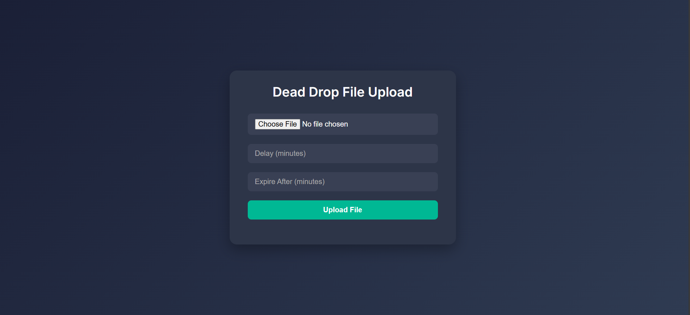

# 🕵️‍♂️ Dead Drop: Serverless File Sharing with AWS

A secure, time-based file sharing system inspired by the concept of a "dead drop" — built entirely using **AWS Free Tier** services and **serverless architecture**.

---

## 📦 Features

-  Upload & Encrypt files securely
-  Delay delivery for a specific time (e.g., 10 minutes from now)
-  Auto-expire files after a set time window
-  Fully serverless using AWS Lambda, S3, Step Functions, and API Gateway
-  HTML + JavaScript frontend for easy uploads
-  100% free-tier compatible!

---

## 🌐 Demo Screenshot

 <!-- Replace or remove this line -->

---

## 🛠️ Tech Stack

| Component       | Service Used            |
|----------------|--------------------------|
| Compute         | AWS Lambda               |
| Storage         | Amazon S3                |
| Orchestration   | AWS Step Functions       |
| API Layer       | Amazon API Gateway       |
| IAM             | AWS IAM (for permissions)|
| Frontend        | Vanilla HTML + JS        |

---

